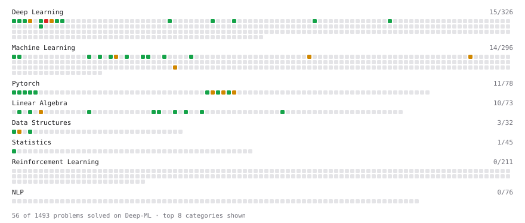

# Deep-ML

My machine learning practice from [Deep-ML](https://www.deep-ml.com). Every solution here was written by hand.

**68** solved · 58 problems · 0 labs · 10 math

[**Browse the interactive portfolio**](https://andresmosqueraw.github.io/deep-ml/) to replay this filling in over time.

## Problems

| | Difficulty | Solved | |
| --- | --- | --- | --- |
| [Add a Bias Vector to a Batch via Broadcasting](https://www.deep-ml.com/problems/882) | easy | 2026-08-16 | [solution](problems/0882-add-a-bias-vector-to-a-batch-via-broadcasting) |
| [Calculate Accuracy Score](https://www.deep-ml.com/problems/36) | easy | 2026-08-20 | [solution](problems/0036-calculate-accuracy-score) |
| [Calculate Cosine Similarity Between Vectors](https://www.deep-ml.com/problems/76) | easy | 2026-08-16 | [solution](problems/0076-calculate-cosine-similarity-between-vectors) |
| [Calculate Covariance Matrix](https://www.deep-ml.com/problems/10) | easy | 2026-08-17 | [solution](problems/0010-calculate-covariance-matrix) |
| [Calculate Mean Absolute Error (MAE)](https://www.deep-ml.com/problems/93) | easy | 2026-08-12 | [solution](problems/0093-calculate-mean-absolute-error-mae) |
| [Calculate Mean by Row or Column](https://www.deep-ml.com/problems/4) | easy | 2026-08-22 | [solution](problems/0004-calculate-mean-by-row-or-column) |
| [Calculate R-squared for Regression Analysis](https://www.deep-ml.com/problems/69) | easy | 2026-08-16 | [solution](problems/0069-calculate-r-squared-for-regression-analysis) |
| [Calculate Root Mean Square Error (RMSE)](https://www.deep-ml.com/problems/71) | easy | 2026-08-13 | [solution](problems/0071-calculate-root-mean-square-error-rmse) |
| [Compute a Gradient with PyTorch Autograd](https://www.deep-ml.com/problems/884) | easy | 2026-08-19 | [solution](problems/0884-compute-a-gradient-with-pytorch-autograd) |
| [Compute Multi-class Cross-Entropy Loss](https://www.deep-ml.com/problems/134) | easy | 2026-08-10 | [solution](problems/0134-compute-multi-class-cross-entropy-loss) |
| [Compute the Cross Product of Two 3D Vectors](https://www.deep-ml.com/problems/118) | easy | 2026-08-14 | [solution](problems/0118-compute-the-cross-product-of-two-3d-vectors) |
| [Convert Vector to Diagonal Matrix](https://www.deep-ml.com/problems/35) | easy | 2026-08-23 | [solution](problems/0035-convert-vector-to-diagonal-matrix) |
| [Create a Float Tensor from a Python List](https://www.deep-ml.com/problems/880) | easy | 2026-08-16 | [solution](problems/0880-create-a-float-tensor-from-a-python-list) |
| [Derivative of a Polynomial](https://www.deep-ml.com/problems/116) | easy | 2026-07-28 | [solution](problems/0116-derivative-of-a-polynomial) |
| [Derivatives of Activation Functions](https://www.deep-ml.com/problems/217) | easy | 2026-08-13 | [solution](problems/0217-derivatives-of-activation-functions) |
| [Dot Product Calculator](https://www.deep-ml.com/problems/83) | easy | 2026-08-08 | [solution](problems/0083-dot-product-calculator) |
| [Generate a Confusion Matrix for Binary Classification](https://www.deep-ml.com/problems/75) | easy | 2026-08-20 | [solution](problems/0075-generate-a-confusion-matrix-for-binary-classification) |
| [Implement a Linear Layer Forward Pass with Matrix Multiplication](https://www.deep-ml.com/problems/883) | easy | 2026-08-17 | [solution](problems/0883-implement-a-linear-layer-forward-pass-with-matrix-multiplication) |
| [Implement Binary Cross-Entropy Loss](https://www.deep-ml.com/problems/263) | easy | 2026-08-09 | [solution](problems/0263-implement-binary-cross-entropy-loss) |
| [Implement Global Average Pooling](https://www.deep-ml.com/problems/114) | easy | 2026-10-01 | [solution](problems/0114-implement-global-average-pooling) |
| [Implement Precision Metric](https://www.deep-ml.com/problems/46) | easy | 2026-08-23 | [solution](problems/0046-implement-precision-metric) |
| [Implement Recall Metric in Binary Classification](https://www.deep-ml.com/problems/52) | easy | 2026-08-20 | [solution](problems/0052-implement-recall-metric-in-binary-classification) |
| [Implement ReLU Activation Function](https://www.deep-ml.com/problems/42) | easy | 2026-08-09 | [solution](problems/0042-implement-relu-activation-function) |
| [Implement ReLU and Leaky ReLU](https://www.deep-ml.com/problems/1226) | easy | 2026-08-20 | [solution](problems/1226-implement-relu-and-leaky-relu) |
| [Implement Ridge Regression Loss Function](https://www.deep-ml.com/problems/43) | easy | 2026-08-14 | [solution](problems/0043-implement-ridge-regression-loss-function) |
| [Implementation of Log Softmax Function](https://www.deep-ml.com/problems/39) | easy | 2026-08-16 | [solution](problems/0039-implementation-of-log-softmax-function) |
| [L2 Normalization Along an Axis](https://www.deep-ml.com/problems/1022) | easy | 2026-08-16 | [solution](problems/1022-l2-normalization-along-an-axis) |
| [Label Encoding for Ordinal Variables](https://www.deep-ml.com/problems/356) | easy | 2026-08-24 | [solution](problems/0356-label-encoding-for-ordinal-variables) |
| [Leaky ReLU Activation Function](https://www.deep-ml.com/problems/44) | easy | 2026-08-09 | [solution](problems/0044-leaky-relu-activation-function) |
| [Learned Positional Embeddings](https://www.deep-ml.com/problems/375) | easy | 2026-08-07 | [solution](problems/0375-learned-positional-embeddings) |
| [Linear Regression Using Gradient Descent](https://www.deep-ml.com/problems/15) | easy | 2026-08-07 | [solution](problems/0015-linear-regression-using-gradient-descent) |
| [Linear Regression Using Normal Equation](https://www.deep-ml.com/problems/14) | easy | 2026-08-13 | [solution](problems/0014-linear-regression-using-normal-equation) |
| [Matrix-Vector Dot Product](https://www.deep-ml.com/problems/1) | easy | 2026-10-02 | [solution](problems/0001-matrix-vector-dot-product) |
| [Mean Squared Error from Scratch](https://www.deep-ml.com/problems/1228) | easy | 2026-08-21 | [solution](problems/1228-mean-squared-error-from-scratch) |
| [Min-Max Scaling of Feature Values](https://www.deep-ml.com/problems/112) | easy | 2026-08-24 | [solution](problems/0112-min-max-scaling-of-feature-values) |
| [Momentum Optimizer](https://www.deep-ml.com/problems/146) | easy | 2026-08-22 | [solution](problems/0146-momentum-optimizer) |
| [Reshape and Transpose a Tensor](https://www.deep-ml.com/problems/881) | easy | 2026-08-14 | [solution](problems/0881-reshape-and-transpose-a-tensor) |
| [Reshape Matrix](https://www.deep-ml.com/problems/3) | easy | 2026-10-02 | [solution](problems/0003-reshape-matrix) |
| [Sigmoid Activation Function Understanding](https://www.deep-ml.com/problems/22) | easy | 2026-08-05 | [solution](problems/0022-sigmoid-activation-function-understanding) |
| [Single Linear Neuron Forward](https://www.deep-ml.com/problems/1224) | easy | 2026-08-06 | [solution](problems/1224-single-linear-neuron-forward) |
| [Single Neuron](https://www.deep-ml.com/problems/24) | easy | 2026-08-06 | [solution](problems/0024-single-neuron) |
| [Softmax Activation Function Implementation ](https://www.deep-ml.com/problems/23) | easy | 2026-08-05 | [solution](problems/0023-softmax-activation-function-implementation) |
| [Transpose of a Matrix](https://www.deep-ml.com/problems/2) | easy | 2026-08-19 | [solution](problems/0002-transpose-of-a-matrix) |
| [Vector Element-wise Sum](https://www.deep-ml.com/problems/121) | easy | 2026-08-08 | [solution](problems/0121-vector-element-wise-sum) |
| [Vector Norms (L1/L2/L-inf) and the Frobenius Norm](https://www.deep-ml.com/problems/328) | easy | 2026-08-14 | [solution](problems/0328-vector-norms-l1-l2-l-inf-and-the-frobenius-norm) |
| [Binary Cross-Entropy from Logits](https://www.deep-ml.com/problems/1229) | medium | 2026-08-21 | [solution](problems/1229-binary-cross-entropy-from-logits) |
| [Calculate Eigenvalues of a Matrix](https://www.deep-ml.com/problems/6) | medium | 2026-08-22 | [solution](problems/0006-calculate-eigenvalues-of-a-matrix) |
| [Compute Confusion Matrix with Normalization](https://www.deep-ml.com/problems/193) | medium | 2026-09-03 | [solution](problems/0193-compute-confusion-matrix-with-normalization) |
| [Derivative of Softmax](https://www.deep-ml.com/problems/219) | medium | 2026-08-14 | [solution](problems/0219-derivative-of-softmax) |
| [Error Analysis from Confusion Matrix](https://www.deep-ml.com/problems/838) | medium | 2026-08-23 | [solution](problems/0838-error-analysis-from-confusion-matrix) |
| [Handle Missing Data with Imputation](https://www.deep-ml.com/problems/354) | medium | 2026-08-28 | [solution](problems/0354-handle-missing-data-with-imputation) |
| [Implement Gradient Descent Variants with MSE Loss](https://www.deep-ml.com/problems/47) | medium | 2026-08-07 | [solution](problems/0047-implement-gradient-descent-variants-with-mse-loss) |
| [Numerically Stable Softmax](https://www.deep-ml.com/problems/1227) | medium | 2026-08-20 | [solution](problems/1227-numerically-stable-softmax) |
| [Product Rule for Derivatives](https://www.deep-ml.com/problems/309) | medium | 2026-07-29 | [solution](problems/0309-product-rule-for-derivatives) |
| [Simple Convolutional 2D Layer](https://www.deep-ml.com/problems/41) | medium | 2026-08-26 | [solution](problems/0041-simple-convolutional-2d-layer) |
| [Single Neuron with Backpropagation](https://www.deep-ml.com/problems/25) | medium | 2026-08-07 | [solution](problems/0025-single-neuron-with-backpropagation) |
| [Two-Layer MLP Forward Pass](https://www.deep-ml.com/problems/1225) | medium | 2026-08-16 | [solution](problems/1225-two-layer-mlp-forward-pass) |
| [Implementing a Custom Dense Layer in Python](https://www.deep-ml.com/problems/40) | hard | 2026-08-21 | [solution](problems/0040-implementing-a-custom-dense-layer-in-python) |

## Math

| | Difficulty | Solved | |
| --- | --- | --- | --- |
| [Derivatives and Gradients](https://www.deep-ml.com/math-problems/1) | easy | 2026-08-02 | [solution](math/0001-derivatives-and-gradients) |
| [Descriptive Statistics](https://www.deep-ml.com/math-problems/18) | easy | 2026-08-08 | [solution](math/0018-descriptive-statistics) |
| [Gradient Descent Updates](https://www.deep-ml.com/math-problems/5) | easy | 2026-08-08 | [solution](math/0005-gradient-descent-updates) |
| [Matrix Basics](https://www.deep-ml.com/math-problems/9) | easy | 2026-08-05 | [solution](math/0009-matrix-basics) |
| [Probability Fundamentals](https://www.deep-ml.com/math-problems/19) | easy | 2026-08-23 | [solution](math/0019-probability-fundamentals) |
| [Vector Operations](https://www.deep-ml.com/math-problems/7) | easy | 2026-08-05 | [solution](math/0007-vector-operations) |
| [Matrix Multiplication](https://www.deep-ml.com/math-problems/10) | medium | 2026-08-05 | [solution](math/0010-matrix-multiplication) |
| [Neural Network Derivatives](https://www.deep-ml.com/math-problems/3) | medium | 2026-08-16 | [solution](math/0003-neural-network-derivatives) |
| [Softmax and Cross-Entropy](https://www.deep-ml.com/math-problems/32) | medium | 2026-08-16 | [solution](math/0032-softmax-and-cross-entropy) |
| [Vector Norms and Linear Independence](https://www.deep-ml.com/math-problems/8) | medium | 2026-08-14 | [solution](math/0008-vector-norms-and-linear-independence) |

---

_This file is regenerated by Deep-ML on every push._
